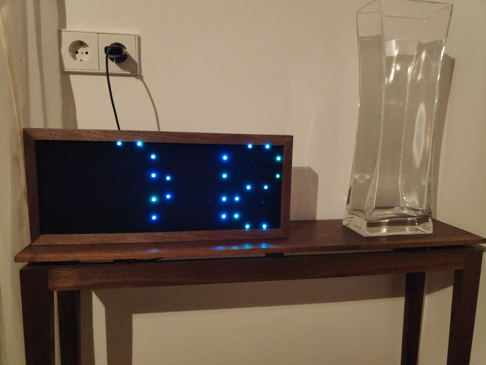
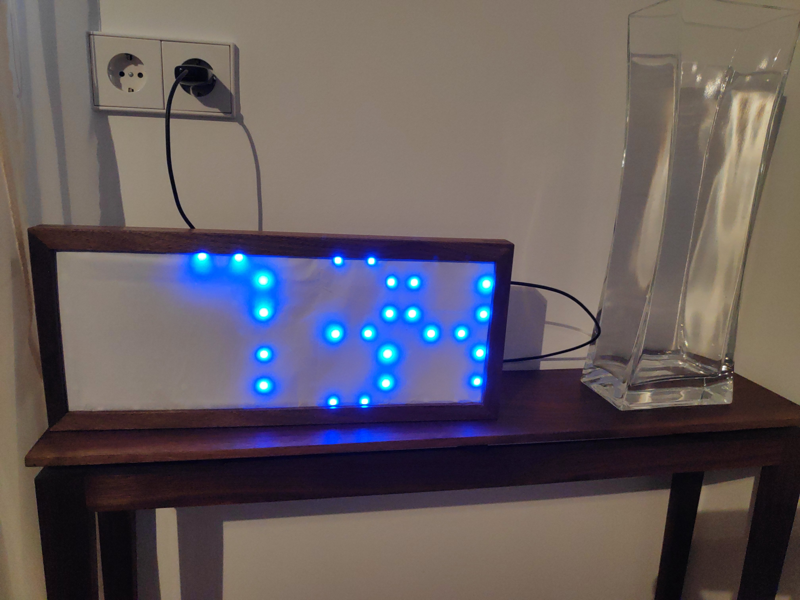

Clock with ESP8266 and WS2812 leds

more images https://workingwoodblog.wordpress.com/2019/11/16/clock-with-esp8266-and-ws2812-leds

copy credentials.h.example to credentials.h and edit your wifi settings.

this works for 2 leds per segment + 2 leds as separator between hous and minutes. that's 58 total. Edit NUM_LEDS for any other number of leds.

The color is changeable. Find out the IP Address of the ESP8266 from your router. Open the IP in your browser.
This project uses the http://jscolor.com javascript library for selecting the color.
